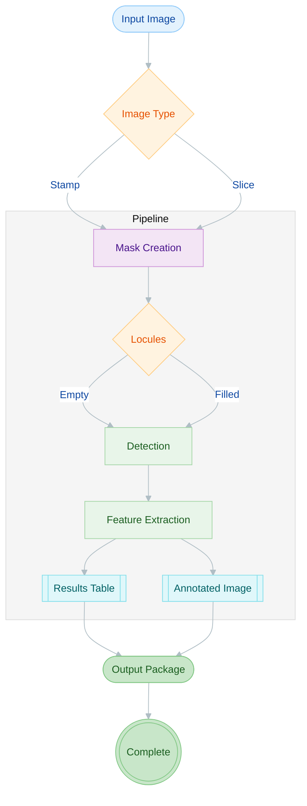

# Workflow

```mermaid

%%{init: {'theme':'base', 'themeVariables': {
  'primaryColor':'#E3F2FD', 'primaryTextColor':'#0D47A1', 'primaryBorderColor':'#90CAF9',
  'lineColor':'#B0BEC5','tertiaryColor':'#F5F5F5','fontSize':'14px','edgeLabelBackground':'#ffffff'
}}}%%
flowchart TD
    A([Input Image]) --> B{Image Type}
    B -->|Stamp| C[Mask Creation]
    B -->|Slice| C

    subgraph Pipeline
      direction LR
      C --> E{Locules}
      E -->|Empty| H[Detection]
      E -->|Filled| H
      H --> I[Feature Extraction]
      I --> J[[Results Table]]
      I --> K[[Annotated Image]]
    end

    J & K --> L([Output Package]) --> M(((Complete)))

    %% Styles (semánticos y sobrios)
    classDef start fill:#E3F2FD,stroke:#90CAF9,color:#0D47A1;
    classDef decision fill:#FFF3E0,stroke:#FFCC80,color:#E65100;
    classDef process fill:#F3E5F5,stroke:#CE93D8,color:#4A148C;
    classDef action fill:#E8F5E9,stroke:#A5D6A7,color:#1B5E20;
    classDef output fill:#E0F7FA,stroke:#80DEEA,color:#006064;
    classDef final fill:#C8E6C9,stroke:#81C784,color:#1B5E20;

    class A start;
    class B,E decision;
    class C process;
    class H,I action;
    class J,K output;
    class L final;
    class M final;

```

